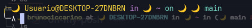

# oh-my-posh

Your favorite theme in oh my posh

## installation

To install it is very simple, just clone the repository to home, then copy the nekonight.omp.json file to the oh-my-posh directory, which in my case is in

`C:\Users\User\AppData\Local\Programs\oh-my-posh\themes`

and then type `notepad $PROFILE`

and pass the path of the oh-my-posh theme into it like this 

`& "C:\Users\User\AppData\Local\Programs\oh-my-posh\bin\oh-my-posh.exe" init pwsh --config "$env:POSH_THEMES_PATH\nekonight.omp.json" | Invoke-Expression`

save and restart your terminal and you will see something like this

